# รีวิวเรียน Computer Science มจพ

ถ้ากำลังหา **รีวิวเรียน Computer Science มจพ** หรืออยากรู้ว่าเรียน **วิทยาการคอมพิวเตอร์ มหาวิทยาลัยเทคโนโลยีพระจอมเกล้าพระนครเหนือ (มจพ.)** แล้วเจออะไรบ้าง ทั้งวิชา บรรยากาศ และการใช้ชีวิตในมอ. บทความนี้สรุปจากประสบการณ์เรียนจริงของผมแบบครบ ๆ จากคลิปรีวิวบน TikTok

ดูโพสต์ต้นทางได้ที่ [Review CS KMUTNB บน TikTok](https://www.tiktok.com/@nattazxin/photo/7332778988907121922) หรือ [ลิงก์สั้น](https://vt.tiktok.com/ZS4S97J44/)

## คณะ / ตึกที่เรียน

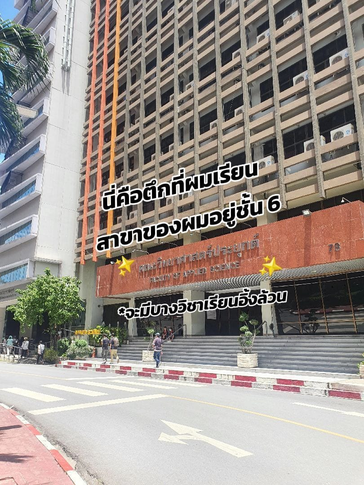

สาขาอยู่ที่ **คณะวิทยาศาสตร์ประยุกต์ (Faculty of Applied Science)**  
ห้องเรียนหลักของสาขาอยู่ประมาณ **ชั้น 6**

จุดที่อยากบอกเพิ่ม: จะมีบางวิชาที่เรียนเป็นภาษาอังกฤษล้วน ถ้าเพิ่งเข้ามาอาจต้องปรับตัวนิดหน่อย แต่ก็เป็นโอกาสฝึกคำศัพท์สายคอมไปในตัว

## การเรียนปี 1

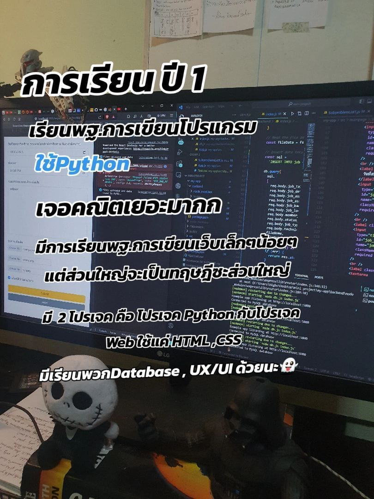

ปีแรกเน้นวางพื้นฐานค่อนข้างชัด

- เรียน **พื้นฐานการเขียนโปรแกรม**
- ภาษาหลักที่ใช้คือ **Python**
- เจอ **คณิตเยอะมาก**
- มีเรียนพื้นฐานการเขียนเว็บเล็กน้อย
- แต่โดยรวมยังเป็น **ทฤษฎี** ค่อนข้างเยอะ
- มีโปรเจคประมาณ 2 ตัว
  - โปรเจค Python
  - โปรเจค Web ใช้แค่ HTML / CSS
- มีเรียนพวก **Database** และ **UX/UI** ด้วย

สรุปสั้น ๆ ของปี 1: ยังไม่โหดแบบโค้ดทั้งวัน แต่ต้องทนคณิตและทฤษฎีให้ได้ แล้วค่อยสะสมพื้นฐานไปปีถัดไป

## การเรียนปี 2

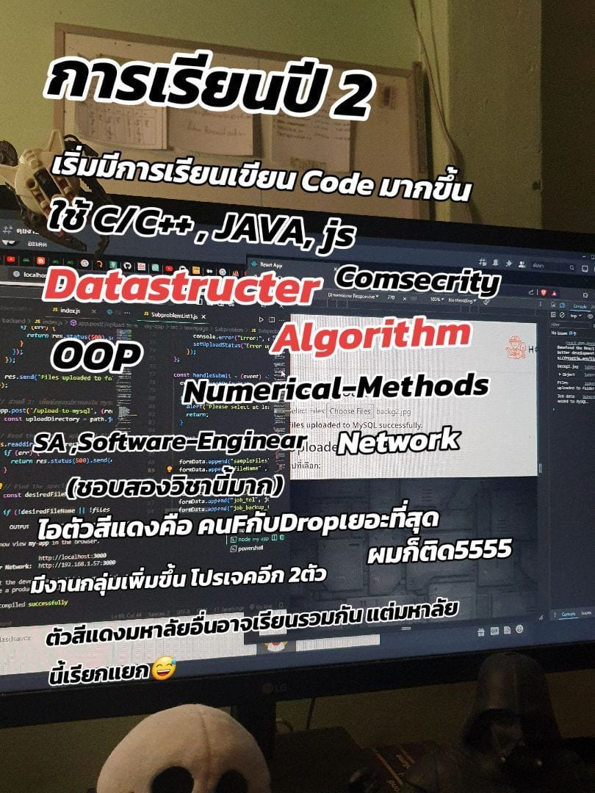

ปี 2 เริ่มเขียนโค้ดมากขึ้นชัดเจน ภาษาที่เจอเยอะขึ้น เช่น

- **C / C++**
- **Java**
- **JavaScript**

วิชาเด่น ๆ ที่เจอ:

- **Data Structure**
- **Algorithm**
- Computer Security
- OOP
- Numerical Methods
- Network
- SA (System Analysis)
- Software Engineering

### วิชาที่คน F / Drop เยอะ

ตัวแดงของปีนี้คือ **Data Structure** กับ **Algorithm**  
คน F กับ Drop เยอะสุด ผมก็ติดเหมือนกัน

หมายเหตุ: มหาวิทยาลัยอื่นอาจเรียนรวมเป็นวิชาเดียว แต่ที่นี่แยกเรียนสองตัว ทำให้ปริมาณงานและความกดดันกระจายมาเต็ม ๆ

ส่วนตัวชอบ **SA** กับ **Software Engineering** มาก เพราะเริ่มเห็นภาพการทำระบบจริงมากขึ้น

ปี 2 งานกลุ่มเพิ่ม และมีโปรเจคเพิ่มอีกประมาณ 2 ตัว

## ก่อนขึ้นปี 3 — แยกสายเรียน

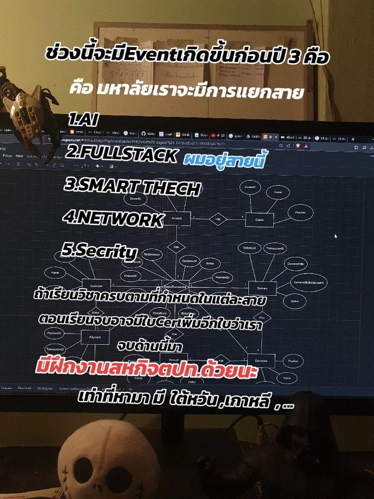

ก่อนเข้าปี 3 จะมีการ **แยกสาย** ให้เลือกโฟกัส เช่น

1. **AI**
2. **Fullstack** (สายที่ผมอยู่)
3. **Smart Tech**
4. **Network**
5. **Security**

ถ้าเรียนครบตามสาย จะได้ **ใบ Cer เพิ่มตอนจบ** รับรองว่าเรียนสายนั้นจริง

อีกจุดที่น่าสนใจคือมีโอกาส **ฝึกงานสหกิจต่างประเทศ** เช่น ไต้หวัน / เกาหลีใต้

## การเรียนปี 3

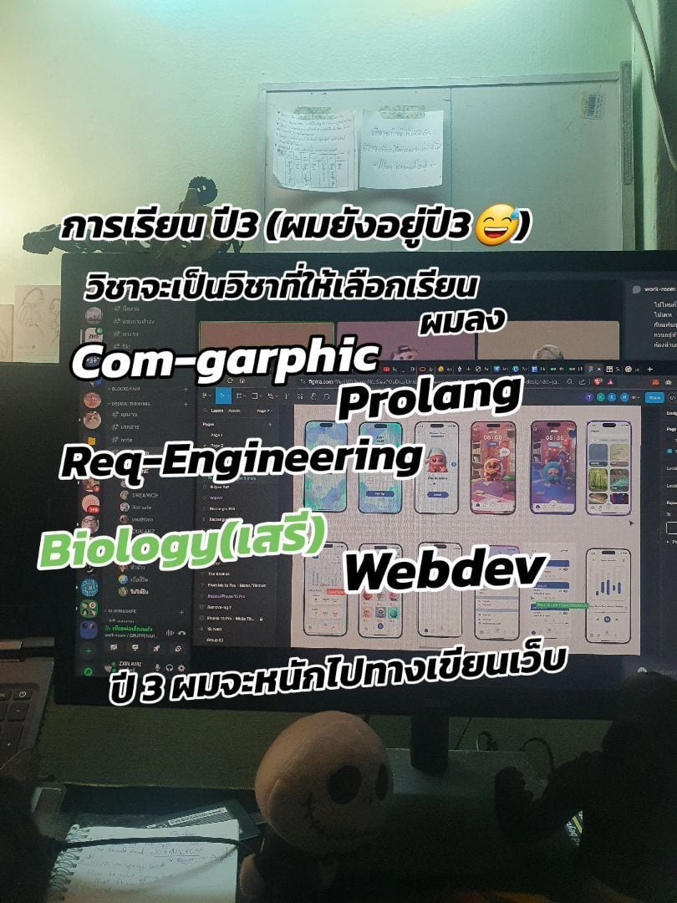

ตอนนี้ผมยังอยู่ปี 3  
ปีนี้จะเป็นวิชาที่เลือกเรียนมากขึ้น ส่วนตัวลงประมาณนี้:

- Computer Graphics
- Programming Languages
- Requirements Engineering
- Biology (วิชาเสรี)
- Web Development

ทิศทางปี 3 ของผมจะหนักไปทาง **เขียนเว็บ** ค่อนข้างชัด ทั้งลงวิชาและทำงานที่เกี่ยวกับเว็บ / UI

## บรรยากาศส่งโปรเจค

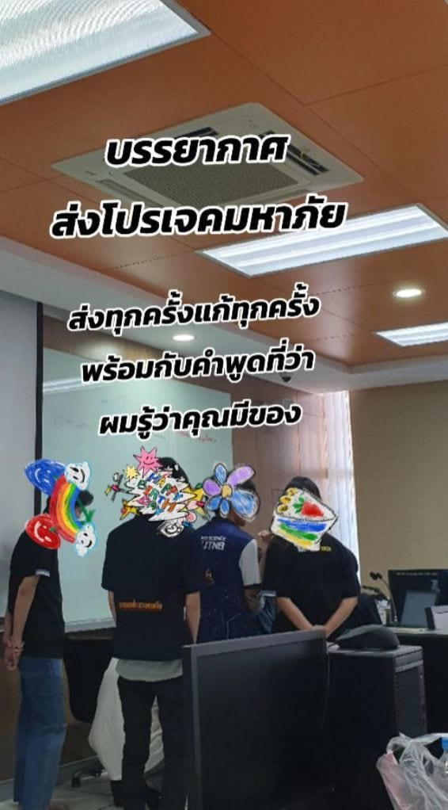

บรรยากาศส่งโปรเจคแบบมหาภัยจริง:

- ส่งทุกครั้ง
- แก้ทุกครั้ง
- วนไปเรื่อย ๆ

พร้อมประโยคคลาสสิกจากอาจารย์ประมาณว่า

> “ผมรู้ว่าคุณมีของ”

คือได้ยินแล้วภูมิใจนะ… แต่ก็รู้ว่ายังต้องแก้ต่ออีกแน่ ๆ

## สังคมเพื่อนในสาขา

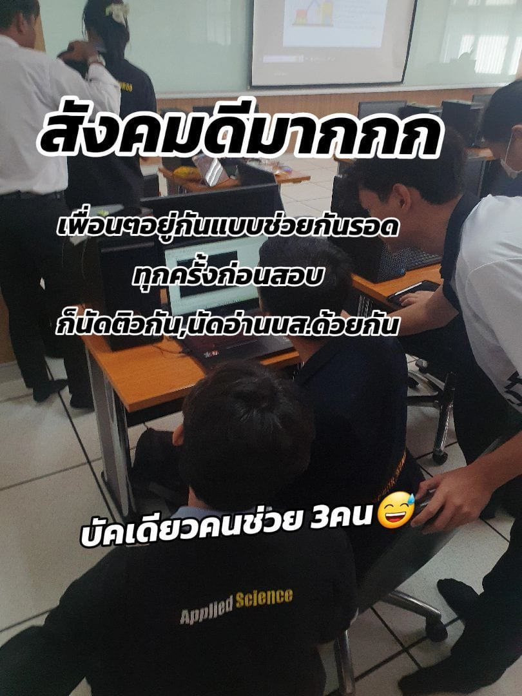

สังคมดีมาก เพื่อน ๆ อยู่กันแบบช่วยกันรอด  
ก่อนสอบมักนัดติว / นัดอ่านหนังสือด้วยกัน และเวลาเจอบัคก็ช่วยกันดูเป็นทีม

เวลาทำงานกลุ่มก็ดี แต่ต้องเลือกคนเข้ากลุ่มดี ๆ ด้วย เพราะบางคนอาจไม่เอางานเลย

## สิ่งอำนวยความสะดวกในมอ.

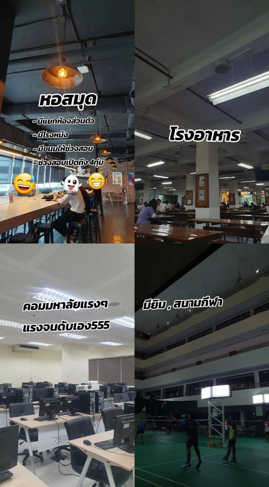

### หอสมุด

- มีแยกห้องส่วนตัว
- มีโรงหนัง
- มีขนมให้ช่วงสอบ
- ช่วงสอบเปิดถึง 4 ทุ่ม
- มีบอร์ดเกมให้เล่นฟรี
- คอมที่หอสมุดแรงและดีมาก

### โรงอาหาร / คาเฟ่

- มีโรงอาหารกินได้จริงในชีวิตประจำวัน
- มีคาเฟ่ในมหาวิทยาลัยหลายจุด นั่งทำงาน / นั่งพักได้สะดวก

### ห้องคอมพิวเตอร์

คอมมหาวิทยาลัยแรงมาก  
แรงจะแรงอาจจนดับเองบ้าง… แต่โดยรวมใช้ทำงาน / ทำแล็บได้สบาย

### กีฬา / กิจกรรม

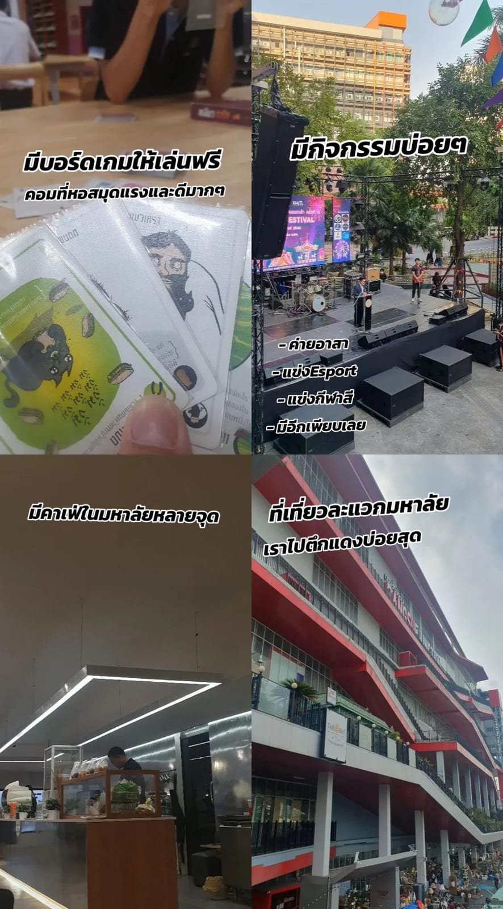

- มียิมและสนามกีฬา
- มีกิจกรรมบ่อย เช่น ค่ายอาสา, แข่ง Esport, แข่งกีฬาสี และอีกเพียบ

### ที่เที่ยวแถวมอ.

แถวมจพ. มีที่เที่ยวให้พักสมองได้  
ส่วนตัวไป **ตึกแดง** บ่อยสุด

## อาหารหลังมอ.

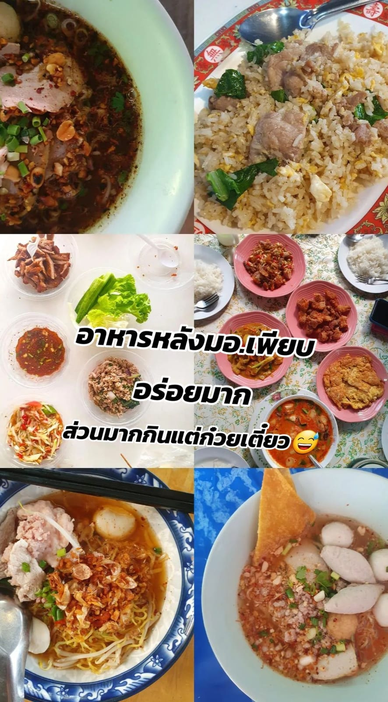

อาหารหลังมอ. เพียบและอร่อยมาก  
มีทั้งก๋วยเตี๋ยว ข้าวผัด ลาบ ส้มตำ ทอมยำ ฯลฯ

แต่พูดตามตรง… ส่วนมากผมกินแต่ก๋วยเตี๋ยว

## สรุปสั้น ๆ

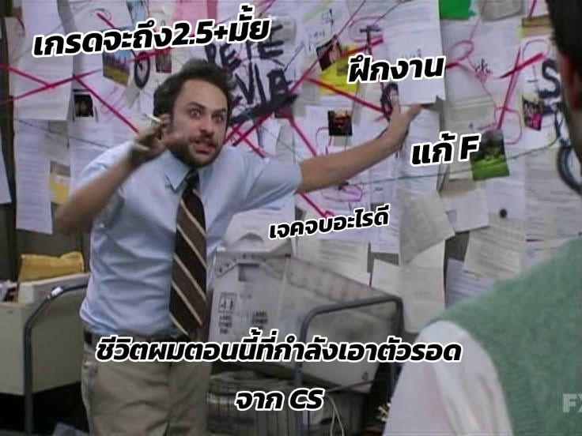

| ปี | ภาพรวม |
| --- | --- |
| ปี 1 | Python + คณิตเยอะ + ทฤษฎี + โปรเจคเล็ก |
| ปี 2 | โค้ดมากขึ้น, DS/Algo โหด, งานกลุ่มเพิ่ม |
| ปี 3 | เลือกสาย / เลือกวิชา, ผมโฟกัส Web / Fullstack |

ถ้ากำลังจะสอบเข้าหรือกำลังลังเลสายวิทย์คอม มจพ. ภาพรวมคือ:

- ปีแรกวางฐาน
- ปีสองโหดขึ้นชัด
- ปีสามเริ่มเลือกทางของตัวเองได้มากขึ้น
- มีทั้งสิ่งอำนวยความสะดวก กิจกรรม และอาหารหลังมอ. ให้ใช้ชีวิตได้ครบ

รายละเอียดวิชาอาจปรับตามปีที่เข้าเรียน แนะนำเช็กหลักสูตรล่าสุดของสาขาเพิ่มเติมด้วย

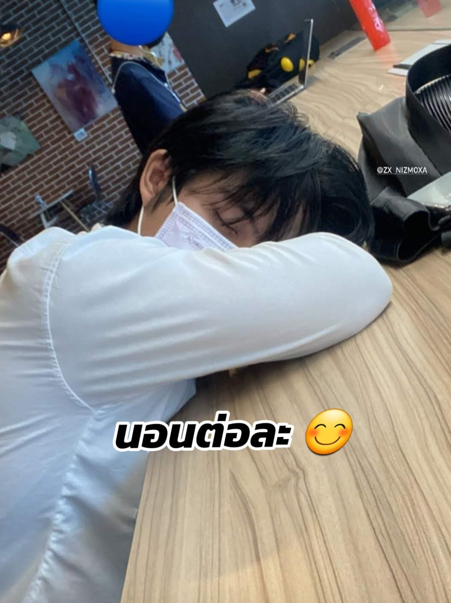

---

**ติดตามเพิ่มเติม**
- TikTok: [@nattazxin](https://www.tiktok.com/@nattazxin)
- โพสต์รีวิวนี้: [Review CS KMUTNB](https://www.tiktok.com/@nattazxin/photo/7332778988907121922)
- บทความก่อนหน้า: [รีวิววิชา Computer Science มจพ](cs-kmutnb-course-review.html)
- Portfolio: [nattazxin.com](https://nattazxin.com/)
